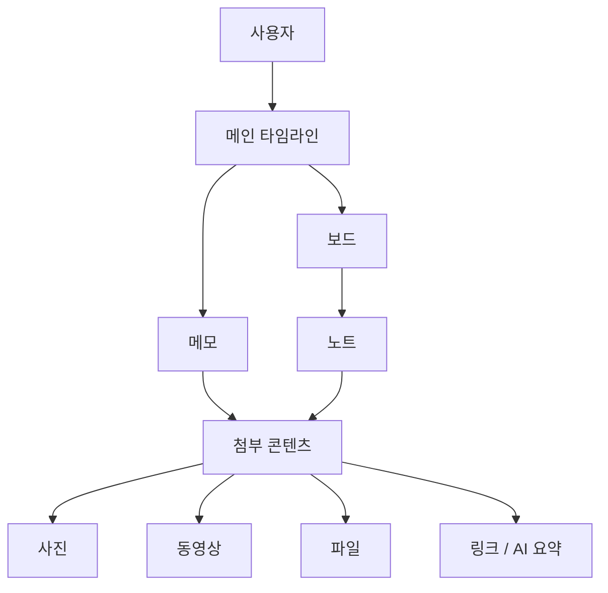
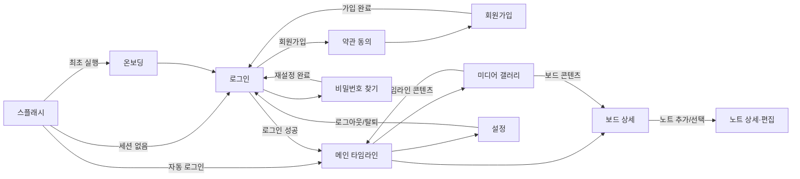
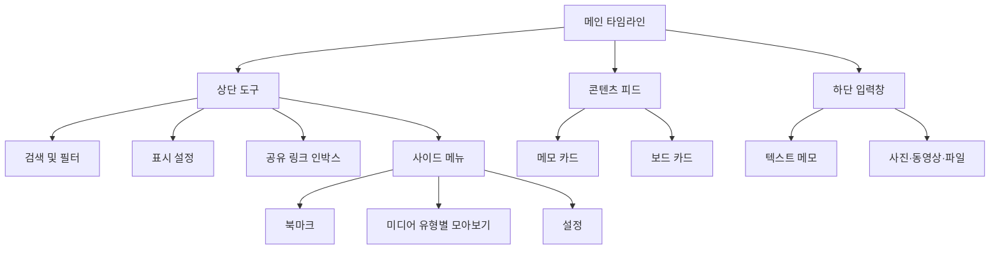

# MEMME Information Architecture

> 작성 기준: 현재 React Native 구현 (`src/navigation`, `src/screens`, `src/components`, `src/types`)
>
> 이 문서는 기획상의 목표 구조가 아니라, 코드에 실제로 구현된 화면과 이동 경로를 기준으로 작성한 As-Is IA이다.

## 1. 서비스 구조 요약

MEMME는 사용자가 메모를 시간순으로 쌓고, 관련 메모를 보드와 노트로 구조화하는 개인 아카이빙 서비스다.



### 콘텐츠 계층

| Level | 객체 | 설명 | 주요 속성 |
|---|---|---|---|
| 1 | 타임라인 | 사용자의 모든 메모와 보드가 노출되는 홈 | 메모, 보드, 작성 시각 |
| 2 | 메모 | 타임라인에 바로 기록하는 독립 콘텐츠 | 텍스트, 첨부, 북마크 |
| 2 | 보드 | 여러 노트를 묶는 분류 단위 | 제목, 설명, 태그, 북마크 |
| 3 | 노트 | 보드 안에 저장되는 상세 콘텐츠 | 제목, 본문, 첨부 |
| 4 | 첨부 콘텐츠 | 메모 또는 노트에 연결되는 자료 | 사진, 동영상, 파일, 링크 |

## 2. 전체 화면 계층

```text
MEMME
├── 앱 진입
│   └── 스플래시 (Splash)
│       ├── 최초 실행 → 온보딩 (Onboarding)
│       ├── 자동 로그인 유효 → 메인 (Main)
│       └── 자동 로그인 무효 → 로그인 (Login)
│
├── 비회원 영역
│   ├── 온보딩 (Onboarding)
│   ├── 로그인 (Login)
│   │   ├── 이메일 로그인
│   │   ├── 카카오 로그인
│   │   ├── Apple 로그인
│   │   ├── 비밀번호 찾기 (ForgotPassword)
│   │   └── 약관 동의 (Terms)
│   │       └── 회원가입 (Signup)
│   └── 회원가입 (Signup)
│       └── 약관 상세 확인 (Terms)
│
└── 회원 영역
    ├── 메인 타임라인 (Main)
    │   ├── 검색
    │   │   └── 필터: 메모 / 보드 / 노트 / 태그 / 사진 / 동영상 / 파일
    │   ├── 표시 설정
    │   │   └── 보드·노트 펼치기 상태
    │   ├── 링크 인박스
    │   ├── 메모 작성
    │   │   └── 사진 / 동영상 / 파일 첨부
    │   ├── 보드 상세 (BoardDetail)
    │   │   ├── 보드 조회·수정
    │   │   ├── 노트 추가 (NoteDetail, 신규)
    │   │   ├── 노트 조회·수정 (NoteDetail, 기존)
    │   │   └── 노트 선택 작업: 이동 / 삭제
    │   └── 사이드 메뉴
    │       ├── 북마크 모아보기
    │       ├── 사진 모아보기 (MediaGallery)
    │       ├── 동영상 모아보기 (MediaGallery)
    │       ├── 링크 모아보기 (MediaGallery)
    │       ├── 파일 모아보기 (MediaGallery)
    │       └── 설정 (Settings)
    └── 설정 (Settings)
        ├── 회원 탈퇴
        ├── 로그아웃
        ├── Memme 소개 (외부 웹)
        ├── 개인정보 처리방침 (외부 웹)
        └── 앱 버전
```

## 3. 내비게이션 맵



## 4. 화면 정의

| Route | 사용자 화면명 | 접근 조건 | 핵심 목적 | 주요 다음 경로 |
|---|---|---|---|---|
| `Splash` | 스플래시 | 앱 실행 | 마이그레이션, 온보딩 및 자동 로그인 상태 판별 | `Onboarding`, `Login`, `Main` |
| `Onboarding` | 온보딩 | 최초 실행 | 서비스 핵심 가치 소개 | `Login` |
| `Login` | 로그인 | 비로그인 | 이메일·소셜 로그인, 계정 관련 진입 | `Main`, `Terms`, `ForgotPassword` |
| `Terms` | 약관 동의 | 회원가입 진입 | 필수·선택 약관 동의 및 약관 상세 확인 | `Signup` |
| `Signup` | 회원가입 | 약관 동의 후 | 이메일 인증과 계정 생성 | `Login`, `Terms` |
| `ForgotPassword` | 비밀번호 찾기 | 로그인 화면 | 이메일 인증 후 비밀번호 재설정 | `Login` |
| `Main` | 메인 타임라인 | 로그인 | 콘텐츠 탐색·검색·작성 및 전체 기능 허브 | `BoardDetail`, `MediaGallery`, `Settings` |
| `BoardDetail` | 보드 상세 | 보드 선택 | 보드 정보와 소속 노트 관리 | `NoteDetail` |
| `NoteDetail` | 노트 상세·편집 | 노트 선택 또는 추가 | 노트 본문과 첨부 콘텐츠 생성·수정 | 이전 화면 |
| `MediaGallery` | 미디어 갤러리 | 사이드 메뉴 | 유형별 콘텐츠 전체 보기 | `BoardDetail`, `Main` |
| `Settings` | 설정 | 사이드 메뉴 | 계정·서비스·앱 정보 관리 | `Login`, 외부 웹 |

## 5. 메인 화면의 기능 구조



### 검색 범위

| 필터 ID | UI 명칭 | 검색 대상 |
|---|---|---|
| `memoTextOnly` | 메모(텍스트) | 메모 텍스트 |
| `board` | 보드 | 보드 제목 및 정보 |
| `note` | 노트 | 노트 제목 및 내용 |
| `tag` | 태그 | 보드 태그 |
| `photo` | 사진 | 사진이 포함된 콘텐츠 |
| `video` | 동영상 | 동영상이 포함된 콘텐츠 |
| `file` | 파일 | 파일이 포함된 콘텐츠 |

## 6. 주요 사용자 흐름

### 신규 가입

```text
스플래시 → 온보딩 → 로그인 → 약관 동의 → 회원가입
→ 이메일 인증 → 가입 완료 → 로그인 → 메인 타임라인
```

### 메모 기록

```text
메인 타임라인 → 텍스트 입력 또는 첨부 선택 → 전송
→ 타임라인에 메모 생성 → 필요 시 북마크 / 수정 / 삭제 / 보드로 변환
```

### 보드와 노트 구성

```text
메인 타임라인 → 보드 생성 또는 선택 → 보드 상세
→ 노트 추가 → 제목·본문·첨부 입력 → 저장
```

### 자료 다시 찾기

```text
방법 A: 메인 → 검색 → 유형 필터 → 결과 선택
방법 B: 메인 → 사이드 메뉴 → 북마크 또는 미디어 유형 → 결과 선택
```

## 7. Route 파라미터

| Route | 파라미터 | 용도 |
|---|---|---|
| `Main` | `scrollToItemId?` | 특정 타임라인 항목으로 이동 |
| `BoardDetail` | `board`, `noteId?`, `onSave?`, `startEditing?` | 대상 보드 전달, 특정 노트 포커스, 즉시 편집 |
| `NoteDetail` | `note`, `boardId`, `boardTitle?`, `isNew?` | 신규 또는 기존 노트 편집 문맥 전달 |
| `MediaGallery` | `items`, `galleryType` | 전체 콘텐츠와 갤러리 유형 전달 |

`galleryType`은 `images`, `videos`, `files`, `links`, `bookmarks` 중 하나다.

## 8. 코드 기준 확인 사항

- 앱 내 화면은 Bottom Tab 없이 하나의 Native Stack으로 구성되어 있다.
- 메인 화면이 홈, 작성, 탐색, 검색의 역할을 모두 담당한다.
- `MediaGallery`는 별도 콘텐츠 저장소가 아니라 전달받은 타임라인 데이터에서 유형별 항목을 추출한다.
- 북마크는 독립 객체가 아니라 메모와 보드의 `bookmarked` 상태를 기준으로 집계한다.
- 노트는 반드시 보드에 속하며 타임라인의 최상위 객체로 직접 노출되지 않는다.
- 회원가입 화면의 약관 링크도 `Terms`로 이동하며, 현재 `Terms`의 완료 동작은 항상 `Signup`으로 이동한다.
- 설정의 Memme 소개와 개인정보 처리방침은 앱 내부 화면이 아닌 외부 웹 페이지다.

## 9. 코드 추적 위치

| 영역 | 기준 파일 |
|---|---|
| 전체 Route 및 파라미터 | `src/navigation/RootNavigator.tsx` |
| 앱 최초 분기 | `src/screens/SplashScreen.tsx` |
| 메인 허브와 화면 이동 | `src/screens/MainScreen.tsx` |
| 보드·노트 계층 | `src/screens/BoardDetailScreen.tsx`, `src/screens/NoteDetailScreen.tsx` |
| 미디어·북마크 탐색 | `src/components/common/SideMenu.tsx`, `src/screens/MediaGalleryScreen.tsx` |
| 콘텐츠 데이터 모델 | `src/types/index.ts` |
| 계정·서비스 메뉴 | `src/screens/SettingsScreen.tsx` |
